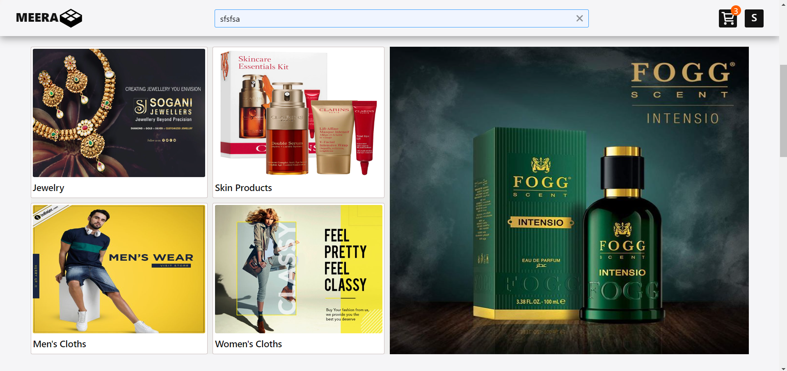
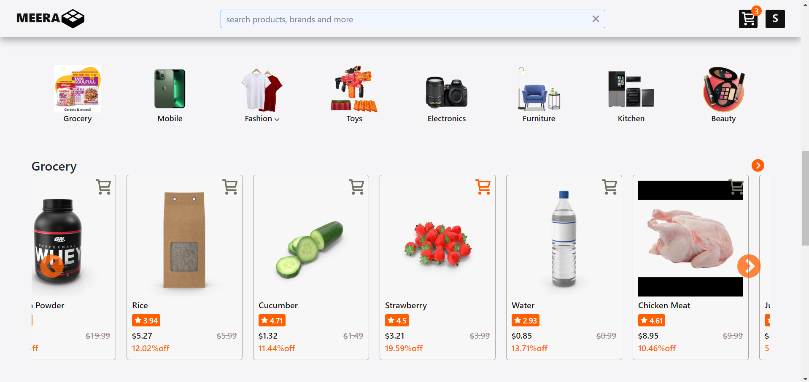
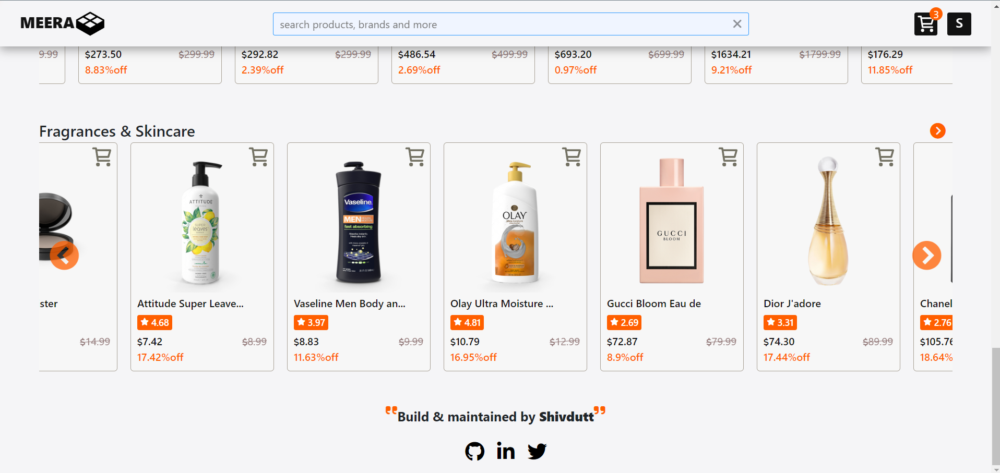
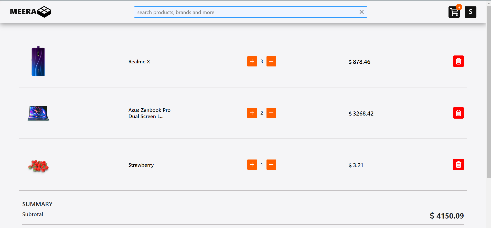
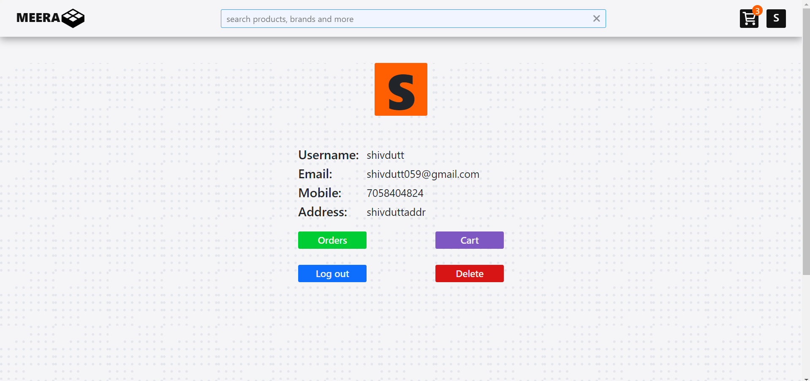
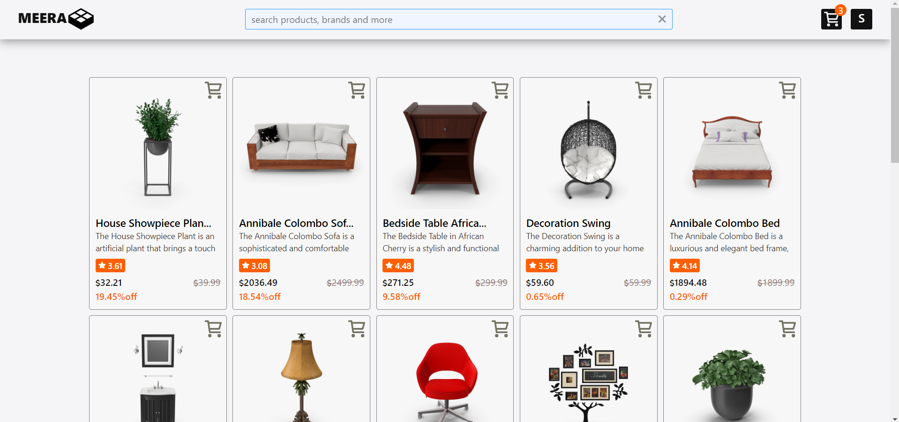
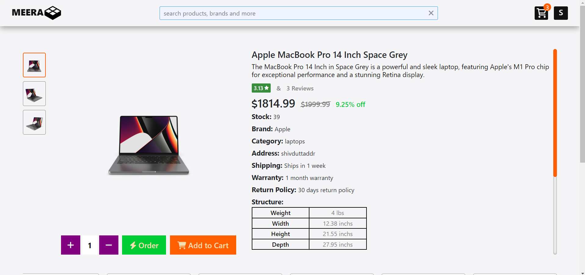
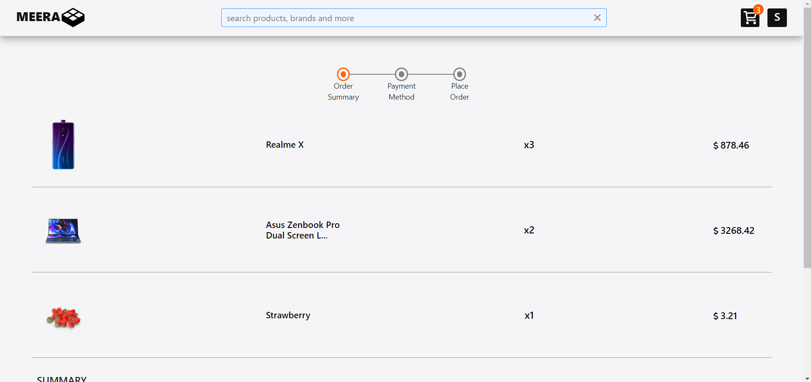
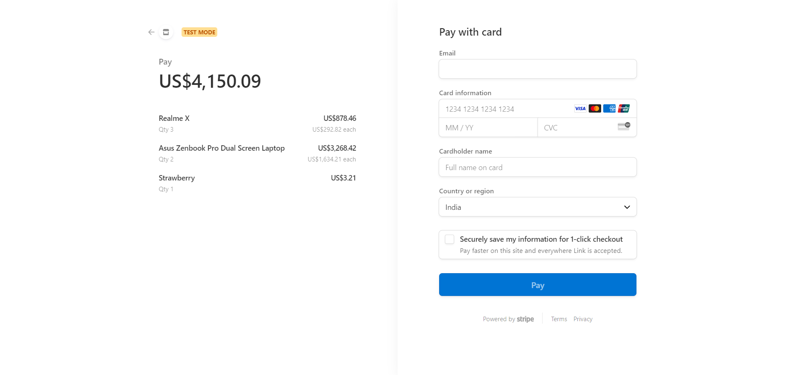

# Apple Homepage Clone
Discover a world of quality and convenience at Meera, where shopping for fashion, electronics, home goods is made easy. Our carefully curated collection offers something for everyone, whether you're looking for the latest trends, essential items, or unique finds
[Meera](https://meera-kohl.vercel.app/)

# Screenshot

---

---

---

---

---

---

---

---

---

# Technologies Used
- html
- css
- javascript
- reactjs
- nodejs
- expressjs
- mongodb(mongoose)

# Description
Meera is built using the MERN stack (MongoDB, Express, React, Node.js) to deliver a robust and responsive user experience. We've integrated Stripe's API to handle secure and efficient payment processing, ensuring that transactions are smooth and reliable.

The backend of our application is hosted on Render, providing scalable and dependable server infrastructure, while the frontend is deployed on Vercel, allowing for rapid delivery and optimized performance. This architecture enables us to offer a seamless shopping experience with high availability and fast load times.

Explore our platform and enjoy a state-of-the-art online shopping experience at Meera.

# Features
- Fast Response.
- Responsive design for various screen sizes.
- Secure payments.
- Clean UI.

# Clone the repository
`https://github.com/shivdutt-B/meera.git`

# Acknowledgements
I would like to acknowledgement myself for creating such great project. I am god.
